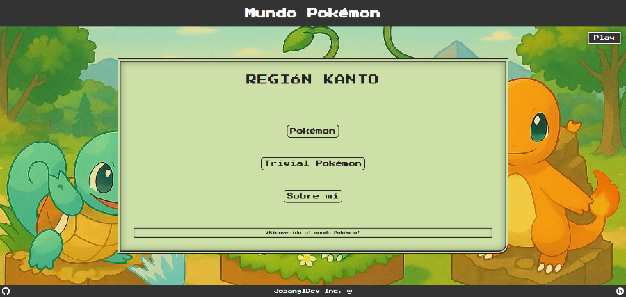

# 🌟 Mundo Pokémon - Región Kanto

[](https://github.com/josangldev/Pokemon-Kanto)
[](https://developer.mozilla.org/en-US/docs/Web/JavaScript)
[](https://sass-lang.com/)
[](https://vitejs.dev/)
[](https://openai.com/)

> **¡Bienvenido al mundo Pokémon!** Una experiencia interactiva que te transporta a la región de Kanto con Pokédex completa, Trivial Pokémon y diseño retro inspirado en Game Boy.



## 🎮 Características

### 📖 **Pokédex Completa**
- **151 Pokémon** de la primera generación
- **Estadísticas detalladas** (PS, Ataque, Defensa, etc.)
- **Búsqueda en tiempo real** por nombre
- **Navegación por carrusel** interactivo

### 🧠 **Trivial Pokémon**
- **50 preguntas** sobre Pokémon Rojo y Azul
- **10 preguntas aleatorias** por partida
- **Sistema de puntuación** en tiempo real
- **Feedback inmediato** con respuestas correctas

### 🎯 **Interfaz Retro**
- **Diseño pixelado** inspirado en Game Boy
- **Pokéball interactiva** como navegación central
- **Tipografía retro** 'Press Start 2P'
- **Audio inmersivo** con música original

## 🛠️ Tecnologías

- **HTML5** - Estructura semántica
- **CSS3** - Estilos avanzados y animaciones
- **JavaScript ES6+** - Funcionalidad interactiva
- **SASS/SCSS** - Preprocesador CSS modular
- **Vite** - Bundler y servidor de desarrollo

## 🤖 Desarrollo Asistido por IA

Este proyecto fue desarrollado con ayuda de la **Inteligencia Artificial**:

- **Optimización de rendimiento** en funciones de búsqueda
- **Revisión completa** de la arquitectura SASS
- **Asistente personal** para el código JavaScript


## 🚀 Instalación

```bash
# Clonar el repositorio
git clone https://github.com/josangldev/Pokemon-Kanto.git

# Navegar al directorio
cd Pokemon-Kanto

# Instalar dependencias
npm install

# Iniciar servidor de desarrollo
npm run dev
```

## 📱 Diseño Responsive

- **Mobile-first** con breakpoints optimizados
- **Adaptable** a tablets y desktop
- **Experiencia fluida** en todos los dispositivos
- **Navegación intuitiva** con gestos táctiles

## 🎨 Características Técnicas

- **Lazy loading** de imágenes
- **Debouncing** en búsquedas
- **Event delegation** para mejor rendimiento
- **ARIA labels** para accesibilidad
- **Compatibilidad** con navegadores modernos

## 👨‍💻 Autor

**José Antonio García López** - [JosanglDev]

- **GitHub**: [@josangldev](https://github.com/josangldev)
- **LinkedIn**: [José Antonio García López](https://www.linkedin.com/in/jos%C3%A9-antonio-garc%C3%ADa-l%C3%B3pez-4ba263347/)

## 🤝 Contribuciones

¡Las contribuciones son bienvenidas! Para contribuir:

1. **Fork** el proyecto
2. **Crea una rama** para tu feature
3. **Commit** tus cambios
4. **Push** a la rama
5. **Abre un Pull Request**

---

<div align="center">

**¡Atrapalos a todos!** 🎮⚡

</div> 